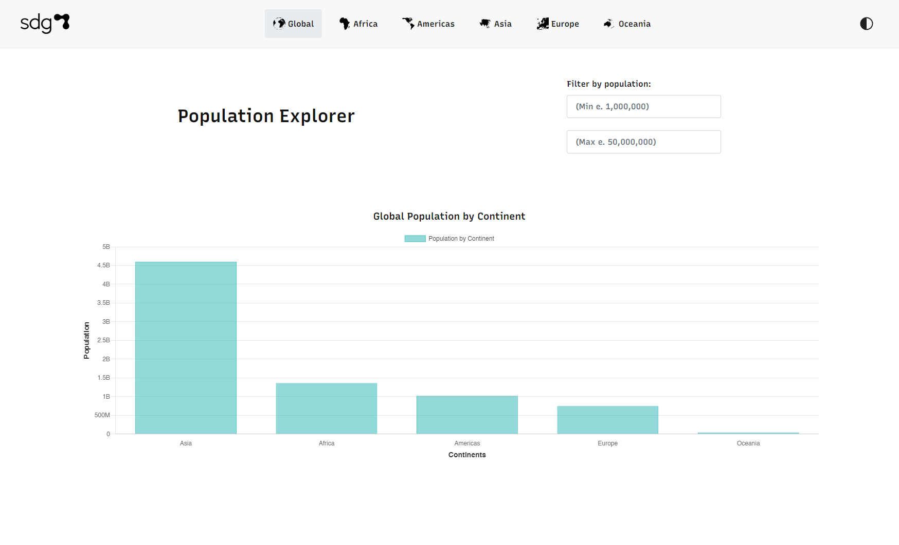
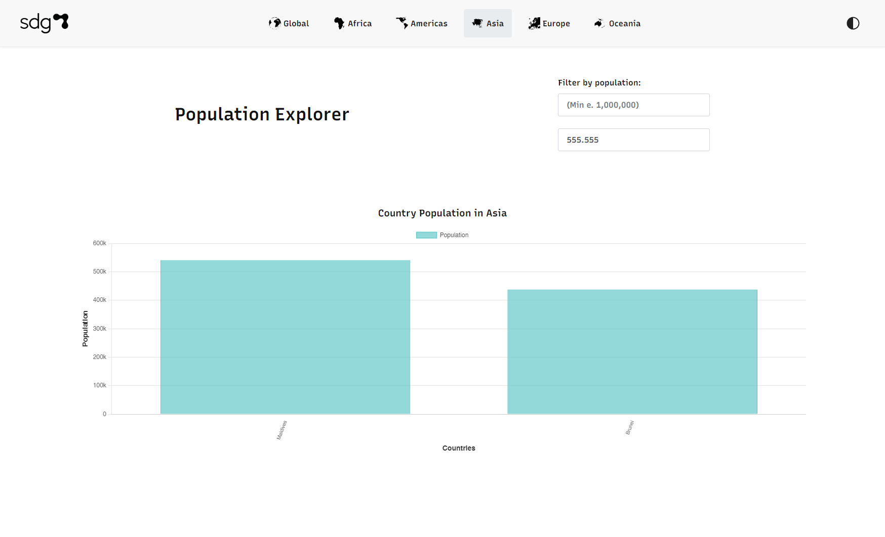
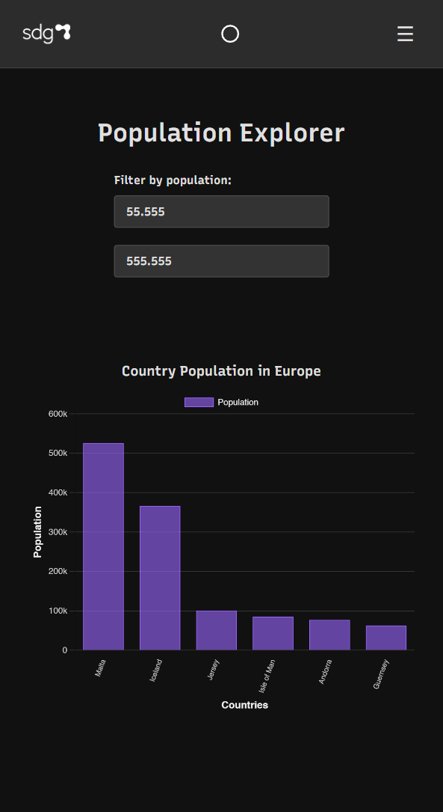

# React Population Visualization App (react-population--vercel)

[](https://reactjs.org/)
[](https://vitejs.dev/)
[](https://bun.sh/)

**Ver Demo en Vivo:** [**Aquí**](https://vercel.com/bajo-codes-projects/react-population-vercel-test)

## 📄 Descripción

Aplicación web interactiva construida con **React** para visualizar datos de población. Este proyecto aprovecha la velocidad y eficiencia de **Vite.js** para el entorno de desarrollo y el proceso de build, y utiliza **Bun** como un gestor de paquetes y runtime de JavaScript ultrarrápido, optimizando tanto la instalación de dependencias como la ejecución de scripts.





## ✨ Características Clave

*   **Interfaz Moderna:** Construida con componentes funcionales de React.
*   **Desarrollo Ultrarrápido:** Experiencia de desarrollo fluida con **Vite.js**, ofreciendo Hot Module Replacement (HMR) casi instantáneo.
*   **Build Optimizado:** **Vite.js** genera un bundle de producción altamente optimizado y eficiente.
*   **Gestión de Paquetes Eficiente:** Instalación y gestión de dependencias significativamente más rápida gracias a **Bun**.
*   **Ejecución Rápida de Scripts:** Los comandos de desarrollo y build se ejecutan velozmente con **Bun**.
*   **Visualización de datos con Gráficos**
*   **Filtrado / Búsqueda de datos** mediante Hooks
*   **Volcado de datos a través de llamadas API**
*   **Despliegue Sencillo:** Configurado para un despliegue fácil y rápido en **Vercel**.

## 🛠️ Stack Tecnológico

*   **Framework Frontend:** [React](https://reactjs.org/) (v18+)
*   **Build Tool & Dev Server:** [**Vite.js**](https://vitejs.dev/)
    *   Utiliza ESBuild para pre-bundling de dependencias.
    *   Sirve código fuente nativo vía ESM durante el desarrollo (Native ESM).
    *   Proporciona HMR extremadamente rápido.
    *   Optimiza el build final con Rollup (por defecto).
*   **Package Manager & Runtime:** [**Bun**](https://bun.sh/)
    *   Reemplaza a npm/yarn para la instalación (`bun install`).
    *   Ejecuta los scripts definidos en `package.json` (`bun run <script>`).
    *   Ofrece un runtime de JavaScript alternativo y veloz.
*   **Lenguaje:** TypeScript
*   **Estilos:** CSS Modules
*   **Librerías Adicionales:**
    *   `chart.js` para gráficos
    *   `axios, react-query` para llamadas API
    *   `gsap.js` para animaciones
    *   `framer motion` para transiciones
    *   `react-router-dom` para rutas
*   **Despliegue:** [Vercel](https://vercel.com/)

## 🏗️ Estructura Completa del Proyecto

```
react-population--vercel/
├── src/
│   ├── assets/               # Archivos estáticos (imágenes, fuentes, iconos, etc.)
│   │   ├── fonts/
│   │   ├── icons/
│   │   └── nav/
│   ├── components/           # Componentes UI reutilizables y genéricos
│   │   └── ui/               # Componentes UI básicos (botones, spinners, etc.)
│   ├── context/              # Contextos de React (ej: ThemeContext)
│   │   ├── AnimationTimingContext.tsx
│   │   └── ThemeContext.tsx
│   ├── hooks/                # Custom Hooks de React reutilizables
│   │   ├── useDebounce.ts
│   │   └── useTheme.ts       # (Este podría estar en context/)
│   ├── layouts/              # Componentes de estructura principal (MainLayout)
│   │   ├── MainLayout.css
│   │   └── MainLayout.tsx
│   ├── modules/              # Organización por Módulos/Características
│   │   ├── continents/       # Módulo para la vista de Continentes
│   │   │   ├── components/   # Componentes específicos de Continentes (Chart)
│   │   │   ├── hooks/        # Hooks específicos de Continentes (useContinentsData)
│   │   │   ├── utils/                # Funciones de utilidad generales
│   │   │   |     └── aggregateData.ts
│   │   │   └── services/ 
│   │   └── countries/        # Módulo para la vista de Países
│   │       ├── components/   # Componentes específicos de Países (Chart)
│   │       ├── hooks/        # Hooks específicos de Países (useCountriesData)
            ├── services/
            └── types/
│   ├── router/               # Configuración de React Router
│   │   ├── index.tsx         # Configuración principal de rutas
│   │   └── paths.ts          # Constantes para las rutas
│   ├── services/             # Lógica para interactuar con APIs externas
│   │   ├── continentService.ts
│   │   └── countryService.ts
│   ├── types/                # Definiciones de tipos TypeScript globales
│   │   └── index.ts
│   ├── utils/                # Funciones de utilidad generales
│   │   └── aggregateData.ts
│   ├── App.tsx               # Componente raíz que configura el Router
│   ├── main.tsx              # Punto de entrada de la aplicación (renderiza App)
│   └── vite-env.d.ts         # Declaraciones de tipos para variables de entorno de Vite
```

**Explicación Breve:**

*   **`assets`:** Contiene recursos estáticos como fuentes, iconos e imágenes.
*   **`components/ui`:** Componentes de interfaz de usuario muy genéricos y reutilizables (botones, spinners, etc.).
*   **`context`:** Define y provee contextos globales de React (como el tema).
*   **`hooks`:** Almacena hooks personalizados reutilizables en diferentes partes de la aplicación (como `useDebounce`).
*   **`layouts`:** Define la estructura principal de la página (cabecera, pie de página, navegación, lugar para el contenido).
*   **`modules`:** Organiza el código por características o secciones principales (continentes, países). Cada módulo contiene sus propios componentes, hooks y vistas específicos. Esta es una buena práctica para aplicaciones medianas/grandes.
*   **`router`:** Contiene la configuración de las rutas de la aplicación usando `react-router-dom`.
*   **`services`:** Encapsula la lógica para hacer llamadas a APIs externas.
*   **`types`:** Define interfaces y tipos de TypeScript compartidos.
*   **`utils`:** Funciones de ayuda genéricas que no encajan en otra categoría.
*   **`App.tsx`:** El componente principal que usualmente configura el proveedor de tema, el enrutador, etc.
*   **`main.tsx`:** El archivo que inicia la aplicación React renderizando el componente `App` en el DOM.
*   **`vite-env.d.ts`:** Archivo específico de Vite + TypeScript para tipos de variables de entorno.

## 🚀 Primeros Pasos

Para ejecutar este proyecto localmente, sigue estos pasos:

### Pre-requisitos

*   **Bun:** Asegúrate de tener Bun instalado. Visita [bun.sh](https://bun.sh/) para las instrucciones de instalación.
    ```bash
    # Comando de instalación típico (puede variar)
    curl -fsSL https://bun.sh/install | bash
    ```
*   **Git:** Necesitas Git para clonar el repositorio.

### Instalación y Ejecución

1.  **Clona el repositorio:**
    ```bash
    git clone https://github.com/bajo-code/react-population--vercel.git
    ```
2.  **Entra al directorio:**
    ```bash
    cd react-population--vercel
    ```
3.  **Instala las dependencias usando Bun:**
    ```bash
    bun install
    ```
    *Nota: Bun leerá `package.json` e instalará las dependencias mucho más rápido que npm/yarn, generando/usando `bun.lockb`.*

4.  **Inicia el servidor de desarrollo (Vite + Bun):**
    ```bash
    bun run dev
    ```
    *Nota: Esto ejecuta el script `dev` definido en `package.json` usando Bun. Vite iniciará el servidor de desarrollo.*

5.  Abre tu navegador y visita `http://localhost:5173` (o el puerto que indique Vite)


## 👤 Autor

*   **bajo-code** - [GitHub Profile](https://github.com/bajo-code)

---